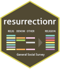

<!-- README.md is generated from README.Rmd. Please edit that file -->
resurrectionr 
==============================================================

The goal of resurrectionr is to …

Installation
------------

``` r
# Install release version from CRAN

# Install development version from GitHub
devtools::install_github("mdjeric/resurrectionr")
```

Example
-------

This is a basic example which shows you how to solve a common problem:

``` r
## basic example code
```
